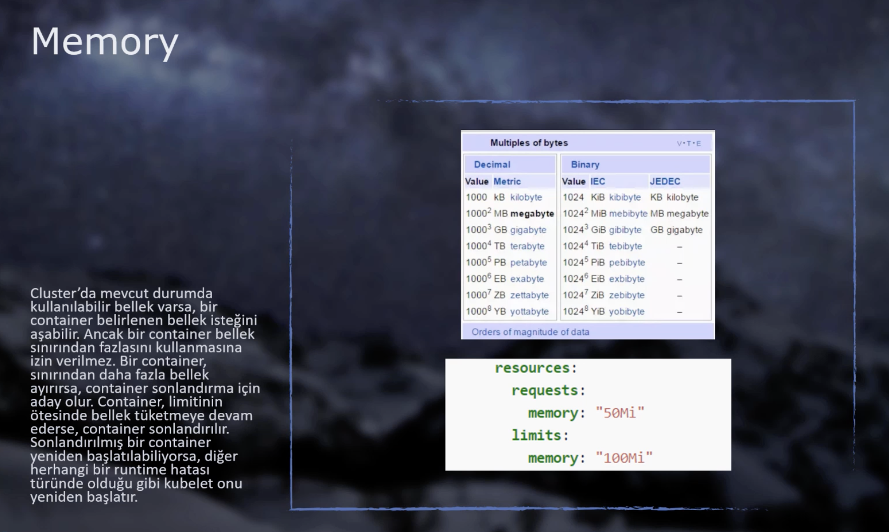

# Kubernetes Objects - Liveness, Readiness, Resource Limits, Environment Variables

## Liveness Probes

Sometimes applications running inside containers may not function correctly despite appearing to be operational. If a running application hasn't crashed or shut down but isn't performing its intended function, kubelet cannot detect this issue.

Liveness probes enable us to determine whether a container is functioning correctly by **sending HTTP requests, establishing TCP connections, or executing commands within the container**.

**Implementation examples:**

<details>
<summary>liveness_probe.yaml</summary>

```yaml
# HTTP GET request example
# If it returns 200 or above, it's successful!
# If not, kubelet will restart the container
apiVersion: v1
kind: Pod
metadata:
  labels:
    test: liveness
  name: liveness-http
spec:
  containers:
    - name: liveness
      image: k8s.gcr.io/liveness
      args:
        - /server
      livenessProbe:
        httpGet: # We're sending a GET request
          path: /healthz # Path definition
          port: 8080 # Port definition
          httpHeaders: # Optional headers for the GET request
            - name: Custom-Header
              value: Awesome
        initialDelaySeconds: 3 # The application may not start immediately,
        # send the request after x seconds of running
        periodSeconds: 3 # How frequently this request will be sent
        # (health check is performed continuously)
---
# Command execution example
# If exit code -1 is received, the container is restarted
apiVersion: v1
kind: Pod
metadata:
  labels:
    test: liveness
  name: liveness-exec
spec:
  containers:
    - name: liveness
      image: k8s.gcr.io/busybox
      args:
        - /bin/sh
        - -c
        - touch /tmp/healthy; sleep 30; rm -rf /tmp/healthy; sleep 600
      livenessProbe:
        exec: # Command is executed
          command:
            - cat
            - /tmp/healthy
        initialDelaySeconds: 5
        periodSeconds: 5
---
# TCP connection example
# If successful, it continues; otherwise, the container is restarted
apiVersion: v1
kind: Pod
metadata:
  name: goproxy
  labels:
    app: goproxy
spec:
  containers:
    - name: goproxy
      image: k8s.gcr.io/goproxy:0.1
      ports:
        - containerPort: 8080
      livenessProbe: # TCP connection is created
        tcpSocket:
          port: 8080
        initialDelaySeconds: 15
        periodSeconds: 20
```

</details>

## Readiness Probes

#### **Deployment Update Process with Readiness Probes**

When a deployment is updated (e.g., with a new image version), Kubernetes follows this sequence:

1. **Deployment Update**: The deployment is updated with the new image (e.g., "v2").
2. **New Pod Creation**: A new Pod with the updated image (v2) is created.
3. **Pod Startup**: The new Pod (v2) starts running.
4. **Readiness Probe Activation**: The readiness check mechanism begins after the `initialDelaySeconds` period.
5. **First Health Check**: The readiness probe performs its first check.
6. **Service Integration**: Once the check passes, the new Pod (v2) is added to the service.
7. **Traffic Switch**: At this point, the old Pod (v1) is removed from the service, but it's not terminated yet.
8. **Graceful Shutdown**: The old Pod (v1) continues processing any existing requests.
9. **Termination Signal**: Kubernetes sends a SIGTERM signal to allow the Pod to shut down gracefully.
10. **Pod Termination**: After completing its processes, the old Pod (v1) terminates itself.

#### **Example Scenario**

Consider a system with 3 Pods and 1 LoadBalancer service. After making an update with a new image, old Pods are removed from service and new ones are added. From the moment new Pods are integrated, the LoadBalancer starts directing incoming traffic. However, what if our applications need to connect to external services, pull data, process it, and then become operational when they first start? During this initialization period, incoming requests won't be answered correctly. In essence, our application is running but not ready to provide service.

**Solution:** **Kubelet** uses **Readiness Probes** to determine when a container is ready to accept traffic (initial status). If all containers in a Pod pass the Readiness Probes check, **the Service is added behind the Pod.**

In the example above, when new images are created, old Pods are not immediately **terminated**. This is because there may be previously received requests and ongoing processes. For this reason, Kubernetes first severs the Pod's relationship with the service, preventing it from receiving new requests, and waits for existing internal requests to complete.

`terminationGracePeriodSeconds: 30` → Existing processes complete, wait 30 seconds, then close. (_30 seconds is the default setting and is generally sufficient._)

**Key Difference:** Readiness probes focus on the initial operational moment, while Liveness probes continuously check whether the application is functioning properly.

> **Example:** Consider a Backend application that needs time to connect to MongoDB when it first starts. It makes sense for the Service to be added behind the Pod only after the MongoDB connection is established. **For this reason, we can use readiness probes here.**

Readiness probes support three different methods, similar to Liveness probes:

* **HTTP GET requests**, **TCP connections**, and **command execution**.

<details>
<summary>readiness_probe.yaml</summary>

```yaml
apiVersion: apps/v1
kind: Deployment
metadata:
  name: frontend
  labels:
    team: development
spec:
  replicas: 3
  selector:
    matchLabels:
      app: frontend
  template:
    metadata:
      labels:
        app: frontend
    spec:
      containers:
        - name: frontend
          image: ozlmulg/k8s:blue
          ports:
            - containerPort: 80
          livenessProbe:
            httpGet:
              path: /healthcheck
              port: 80
            initialDelaySeconds: 5
            periodSeconds: 5
          readinessProbe:
            httpGet:
              path: /ready    # A request is sent to this endpoint; if it returns OK, the application is ready
              port: 80
            initialDelaySeconds: 20 # First check is made after 20 seconds delay from startup
            periodSeconds: 3 # Continues trying every 3 seconds
            terminationGracePeriodSeconds: 50 # Explanation provided above
---
apiVersion: v1
kind: Service
metadata:
  name: frontend
spec:
  selector:
    app: frontend
  ports:
    - protocol: TCP
      port: 80
      targetPort: 80
```

</details>

## Resource Limits

Resource limits allow us to manage CPU and Memory restrictions for Pods. Unless specified otherwise, Pods can utilize 100% of the CPU and Memory of the machine they run on in Kubernetes. This situation can create resource contention issues. For this reason, we can specify how much CPU and Memory Pods will use.

### CPU Definition


### Memory Definition



### YAML Configuration

```yaml
apiVersion: v1
kind: Pod
metadata:
  labels:
    test: requestlimit
  name: requestlimit
spec:
  containers:
  - name: requestlimit
    image: ozlmulg/stress
    resources:
      requests: # Minimum requirements needed for the Pod to function
        memory: "64M"	# This Pod needs at least 64M memory
        cpu: "250m" # = Quarter CPU core = "0.25"
      limits: # Maximum limits for the Pod to function
        memory: "256M"
        cpu: "0.5" # = Half CPU Core = "500m"
```

**Important Notes:**
* If requirements cannot be met, **the container cannot be created.**
* Memory behaves differently than CPU. Kubernetes doesn't block when memory requests exceed limits. If memory usage exceeds limits, the Pod enters "OOMKilled" state and is restarted.

> **Research Topic:** How should we determine the limits and minimum requirements for a Pod?

## Environment Variables

Consider a scenario where we create a Node.js server and store database information directly in server files. If the container image created from these server files falls into unauthorized hands, a major security vulnerability occurs. For this reason, we need to use **Environment Variables**.

### YAML Configuration

```yaml
apiVersion: v1
kind: Pod
metadata:
  name: envpod
  labels:
    app: frontend
spec:
  containers:
  - name: envpod
    image: ozlmulg/env:latest
    ports:
    - containerPort: 80
    env:
      - name: USER   # First we specify the name
        value: "TestName"  # Then we specify the value
      - name: database
        value: "testdb.example.com"
```

### Viewing Environment Variables Defined in Pods

```shell
kubectl exec <podName> -- printenv
```

### Accessing the Application

```shell
kubectl port-forward pod/envpod 8080:80
```

Then open `localhost:8080` in your browser.

## References

- [Kubernetes Official Liveness Readiness Probes Overview](https://kubernetes.io/docs/tasks/configure-pod-container/configure-liveness-readiness-startup-probes/)
- [GitHub - Aytitech K8sFundamentals - Liveness Readiness Probes](https://github.com/aytitech/k8sfundamentals/tree/main/liveready)
- [GitHub - Aytitech K8sFundamentals - Request Limit](https://github.com/aytitech/k8sfundamentals/tree/main/requestlimit)
