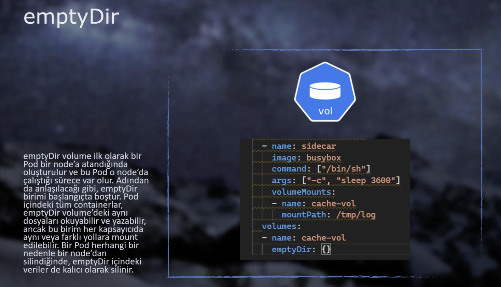
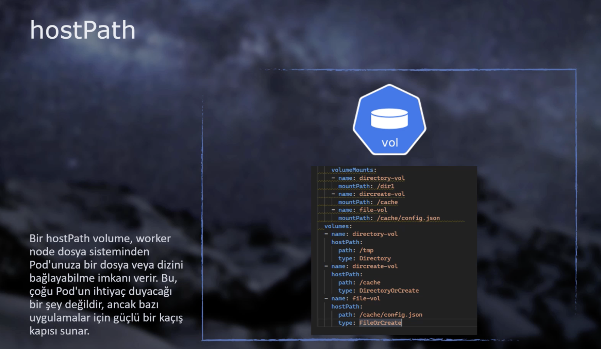

# Kubernetes Objects - Volume, Secret, ConfigMap

## Volume

* Container files are kept in a file as long as the container exists. If the container is deleted, these files are also
  deleted. Every time a new container is created, files belonging to the container are recreated. (Stateless concept)
* In some containers, these files may need to not be deleted (kept). This is where the **Ephemeral (Temporary) Volume
  concept** comes into play. (Stateful concept) For example; To avoid data loss in DB container, **volume** structure
  should be set up.
* Ephemeral Volumes can be connected to all containers in the same pod simultaneously.
* Another purpose is to create an area that multiple containers in the same pod can use together.

> In Ephemeral Volumes, if the Pod is deleted, all data is lost. However, if the container is deleted and recreated, the
> data is preserved as long as nothing happens to the Pod.

There are 2 types of Ephemeral Volume:

### emptyDir Volume



Sample YAML file to create an emptyDir volume:

<details>
<summary>emptydir.yaml</summary>

```yaml
apiVersion: v1
kind: Pod
metadata:
  name: emptydir
spec:
  containers:
    - name: frontend
      image: ozlmulg/k8s:blue
      ports:
        - containerPort: 80
      livenessProbe:
        httpGet:
          path: /healthcheck
          port: 80
        initialDelaySeconds: 5
        periodSeconds: 5
      volumeMounts:
        - name: cache-vol # to provide connection with volume.
          mountPath: /cache # which file in the volume?
    - name: sidecar
      image: busybox
      command: [ "/bin/sh" ]
      args: [ "-c", "sleep 3600" ]
      volumeMounts:
        - name: cache-vol
          mountPath: /tmp/log # which file in the volume?
  volumes:
    - name: cache-vol # First we create the volume, then we define it to containers.
      emptyDir: { }
```

</details>

### hostPath Volume

* It's used very rarely, care should be taken when using it.
* While the volume folder is created inside the pod in emptyDir, the volume folder is created inside the worker node in
  hostPath.
* It's used in 3 different types:
    * **Directory** –> Used for folders that already exist on the worker node.
    * **DirectoryOrCreate** –> Used for already existing folders or to create this folder if it doesn't exist.
    * **FileOrCreate** –> Not a folder! Used for a single file. If it doesn't exist, it's created.



Sample YAML file to create a hostPath volume:

<details>
<summary>hostpath.yaml</summary>

```yaml
apiVersion: v1
kind: Pod
metadata:
  name: hostpath
spec:
  containers:
    - name: hostpathcontainer
      image: ozlmulg/k8s:blue
      ports:
        - containerPort: 80
      livenessProbe:
        httpGet:
          path: /healthcheck
          port: 80
        initialDelaySeconds: 5
        periodSeconds: 5
      volumeMounts:
        - name: directory-vol
          mountPath: /dir1
        - name: dircreate-vol
          mountPath: /cache
        - name: file-vol
          mountPath: /cache/config.json
  volumes:
    - name: directory-vol
      hostPath:
        path: /tmp
        type: Directory
    - name: dircreate-vol
      hostPath:
        path: /cache
        type: DirectoryOrCreate
    - name: file-vol
      hostPath:
        path: /cache/config.json
        type: FileOrCreate
```

</details>

## Secret

* Although we can store sensitive information (DB User, Pass, etc.) in Environment Variables, this method may not be
  ideal.
* Thanks to the Secret object, we separate these sensitive information from the YAML files where we make the
  application's object definitions and can manage them separately.
* It's always safer and more flexible to store all information such as token, username, password, etc. in secret.

### Creating Declarative Secret

* The secret we will assign and the pods we will create **must be on the same namespace.**
* We can create 8 different types of secret. **`Opaque`** is a generic type and we can store almost all our sensitive
  data using this type.

An example secret.yaml file:

```yaml
apiVersion: v1
kind: Secret
metadata:
  name: mysecret
type: Opaque
stringData: # We write sensitive data under stringData.
  db_server: db.example.com
  db_username: admin
  db_password: P@ssw0rd!
```

To see the data in the secret:

```shell
kubectl describe secrets <secretName>
```

### Creating Imperative Secret

```shell
kubectl create secret generic <secretName> --from-literal=db_server=db.example.com --from-literal=db_username=admin
```

⚠️ `generic` here corresponds to `Opaque` that we wrote in yaml.

–> If we don't want to enter sensitive data on CLI, we can enter each data in a separate `.txt` file; and run the
`–from-file=db_server=server.txt` command. We can also use `.json` instead of `.txt`. Then we should write
`–from-file=config.json`.

Json example:

```yaml
{
  "apiKey": "9bxa108d4b2212f2c30c71dfa279e1f77cc5c3b1",
}
```

### Reading Secret from Pod

–> There are 2 methods to transfer the Secrets we created to the Pod:

​ **Transfer as Volume** and **Transfer as Env variable**

You can find both methods in the YAML file below:

<details>
<summary>secretpodvolume.yaml</summary>

```yaml
apiVersion: v1
kind: Pod
metadata:
  name: secretpodvolume
spec:
  containers:
    - name: secretcontainer
      image: ozlmulg/k8s:blue
      volumeMounts: # 2) We include the created secret volume in the pod.
        - name: secret-vol
          mountPath: /secret # 3) The /secret folder in the application is included in the volume. 
          # Now we can reach this file from within the application and read the values.
  volumes: # 1) First we create the volume and include the secret in the volume.
    - name: secret-vol
      secret:
        secretName: mysecret3
        # When we enter this pod with exec, we will see a secret folder under root. The name of the files here is "KEY", the values inside are "VALUE". 
---
apiVersion: v1
kind: Pod
metadata:
  name: secretpodenv
spec:
  containers:
    - name: secretcontainer
      image: ozlmulg/k8s:blue
      env: # We can define all secrets as env. variables in the pod.
        # In this method, we defined all secrets and their values one by one.
        - name: username
          valueFrom:
            secretKeyRef:
              name: mysecret3 # Take the value with "db_username" key from the secret named mysecret3.
              key: db_username
        - name: password
          valueFrom:
            secretKeyRef:
              name: mysecret3
              key: db_password
        - name: server
          valueFrom:
            secretKeyRef:
              name: mysecret3
              key: db_server
---
apiVersion: v1
kind: Pod
metadata:
  name: secretpodenvall
spec:
  containers:
    - name: secretcontainer
      image: ozlmulg/k8s:blue
      envFrom: # Same as method 2, only difference is we define all secrets at once.
        - secretRef:
            name: mysecret3
```

</details>

**Seeing All Env Variables in Pods**

```shell
kubectl exec <podName> -- printenv
```

## ConfigMap

* ConfigMaps work with exactly the same logic as Secret objects. The only difference is; Secrets are stored encrypted on
  etcd encoded with base64. ConfigMaps are not encrypted and therefore should not contain sensitive data.
* We can define it as **Volume** or **Env. Variables** in the Pod.
* Since the creation methods are the same as Secret, the commands above are valid.

<details>
<summary>configmap.yaml</summary>

```yaml
apiVersion: v1
kind: ConfigMap
metadata:
  name: myconfigmap
data: # Should be entered in Key-Value format.
  db_server: "db.example.com"
  database: "mydatabase"
  site.settings: | # "|" is used for multi-line writing.
    color=blue
    padding:25px
---
apiVersion: v1
kind: Pod
metadata:
  name: configmappod
spec:
  containers:
    - name: configmapcontainer
      image: ozlmulg/k8s:blue
      env:
        - name: DB_SERVER
          valueFrom:
            configMapKeyRef:
              name: myconfigmap
              key: db_server
        - name: DATABASE
          valueFrom:
            configMapKeyRef:
              name: myconfigmap
              key: database
      volumeMounts:
        - name: config-vol
          mountPath: "/config"
          readOnly: true
  volumes:
    - name: config-vol
      configMap:
        name: myconfigmap
```

</details>

### Creating ConfigMap from `config.yaml` File

Let's think we have `config.qa.yaml` or `config.prod.json` files for each environment (QA, SIT and PROD) to be used in
our application. How can we create ConfigMap from the correct config file that will work according to these environments
in CI/CD?

<details>
<summary>config.json</summary>

```json
{
  "name": "TestName",
  "surName": "TestSurname",
  "email": "test@testmail.com",
  "apiKey": "9bxa108d4b2212f2c30c71dfa279e1f77cc5c3b1",
  "text": [
    "test",
    "example",
    "one",
    "two",
    3,
    true
  ]
}
```

</details>

1. Let's create a ConfigMap object from our config.json file through Kubectl.

   **If we're running on a CI/CD and will track the logs;**

```shell
# --dry-run is normally deprecated, but still used in older versions.
kubectl create configmap xyzconfig --from-file ${configFile} -o yaml --dry-run | kubectl apply -f -

# new version --dry-run="client"
kubectl create configmap testconfig --from-file config.json -o yaml --dry-run="client" | kubectl apply -f -

# The "-" (dash) at the end takes the output from the first part of the pipe.
```

* When we run the command above, kubectl takes the config.json file; creates a ConfigMap YAML file content that we can
  use with the `kubectl apply` command and **prints this content to the screen as output** due to the **`–dry-run`**
  option.
* We take the incoming output (with bash "pipe | ") and send it to our cluster with the `kubectl apply` command and make
  the ConfigMap introduction.

**If we want to create a ConfigMap directly from the config.json file without reading the logs;**

```shell
# We can use many format files instead of config.json: EX: yaml
kubectl create configmap <configName> --from-file config.json
```

2\. Now when creating the Pod, we need to transfer the values in our ConfigMap to a file in a folder inside the Pod and
store it as a file in "volume" logic.

* Let's define our volume and configMap in the "volumes" section.
* In the "volumeMounts" section inside the Pod, let's introduce this volume we defined to our pod.
    * In the **`mountPath`** section, we can specify under which folder the file in the configMap will be copied inside
      the Pod and what its new name will be.
    * With **`subPath`**, we need to give the name of the file in the configMap (EX: `config.json`). Thus, when the Pod
      is created, we say "This file's name will change."

<details>
<summary>configmappod4.yaml</summary>

```yaml
apiVersion: v1
kind: Pod
metadata:
  name: configmappod4
spec:
  containers:
    - name: configmapcontainer
      image: ozlmulg/k8s:blue
      volumeMounts:
        - name: config-vol
          mountPath: "/config/newconfig.json"
          subPath: "config.json"
          readOnly: true
  volumes:
    - name: config-vol
      configMap:
        name: test-config # This ConfigMap contains the config.json file.
```

</details>

#### **Different writing of Volumes**

We can also write the volumes section in a different way:

<details>
<summary>configmappod.yaml</summary>

```yaml
apiVersion: v1
kind: Pod
metadata:
  name: configmappod
spec:
  containers:
    - name: configmapcontainer
      image: ozlmulg/k8s:blue
      volumeMounts:
        - name: config-vol
          mountPath: "/config/newconfig.json"
          subPath: "config.json"
          readOnly: true
  volumes:
    - name: config-vol
      projected:
        sources:
          - configMap:
              name: test-config
              items:
                - key: config.json
                  path: config.json
```

</details>

## References

- [Kubernetes Official Volume Overview](https://kubernetes.io/docs/concepts/storage/volumes/)
- [Kubernetes Official Secrets Overview](https://kubernetes.io/docs/concepts/configuration/secret/)
- [Kubernetes Official Configmaps Overview](https://kubernetes.io/docs/concepts/configuration/configmap/)
- [GitHub - Aytitech K8sFundamentals - Volume](https://github.com/aytitech/k8sfundamentals/tree/main/volume)
- [GitHub - Aytitech K8sFundamentals - Secret/Configmap](https://github.com/aytitech/k8sfundamentals/tree/main/secretconfigmap)