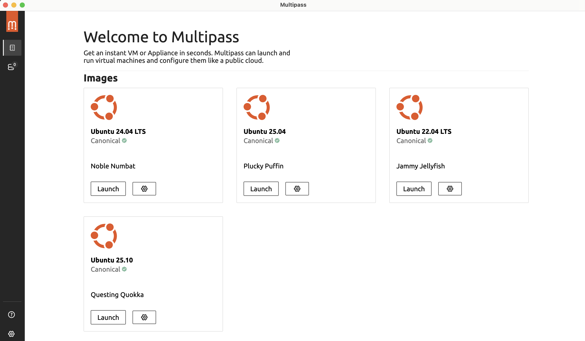

# Multipass

Multipass is a lightweight VM manager developed by Canonical that allows you to run Ubuntu virtual machines quickly and
easily on macOS, Linux, and Windows. It is ideal for developers who want a clean Ubuntu environment for testing or
development.

---

## What is Multipass?

Multipass is a tool for launching and managing lightweight Ubuntu virtual machines. It provides:

- Quick VM provisioning
- Minimal setup
- Cross-platform support (Mac, Linux, Windows)
- CLI commands for VM management

It is perfect for testing, development, and experimenting without affecting your host system.

---

## Why Use Multipass?

- Quickly spin up Ubuntu environments
- Isolate development environments
- Test applications in a clean OS
- Easily create, delete, and manage multiple VMs

---

## How Multipass Works

Multipass does **not** use Docker containers. Instead, it launches full Ubuntu virtual machines using the host system's
hypervisor:

- **macOS:** HyperKit
- **Linux:** KVM (Kernel-based Virtual Machine)
- **Windows:** Hyper-V

This provides a fully isolated operating system, unlike Docker, which uses container-based virtualization.

---

## Installation

### Mac

The recommended way to install Multipass on macOS is via **Homebrew**:

```bash
brew install --cask multipass
```

After installation, verify it with:

```bash
multipass version
```

You can also download the official `.dmg` file from the [Multipass website](https://multipass.run/).

And you can use the Multipass GUI app for managing your VMs visually:



### Linux

Multipass is available for Linux distributions like Ubuntu, Debian, Fedora, and CentOS. The easiest way is to use the
official snap package:

```bash
sudo snap install multipass
```

Verify installation:

```bash
multipass version
```

---

## Basic Usage

### Help

```bash
multipass help
```

### Launch a New VM

```bash
multipass launch --name my-ubuntu-vm
```

This will download the latest Ubuntu image and start a VM named `my-ubuntu-vm`.

### List Running VMs

```bash
multipass list
```

### Access a VM

```bash
multipass shell my-ubuntu-vm
```

### Stop a VM

```bash
multipass stop my-ubuntu-vm
multipass stop --all
```

### Delete a VM

```bash
multipass delete my-ubuntu-vm
multipass purge
```

---

## Advanced Features

- **Mount Local Folders**: Access local files from your VM:

```bash
multipass mount /path/to/local my-ubuntu-vm:/home/ubuntu/mounted
```

- **Execute Commands**:

```bash
multipass exec my-ubuntu-vm -- ls /home/ubuntu
```

- **Specify Ubuntu Version**:

```bash
multipass launch 22.04 --name ubuntu22
```

- **Set Resources** (CPU, RAM, Disk):

```bash
multipass launch --name big-vm --cpus 4 --mem 4G --disk 20G
```

---

## References

- [Official Multipass Documentation](https://canonical.com/multipass)
- [Ubuntu Multipass Documentation](https://documentation.ubuntu.com/multipass)
- [Multipass GitHub Repository](https://github.com/canonical/multipass)
- [Ubuntu Official Site](https://ubuntu.com)
- [Snap Package Info](https://snapcraft.io/multipass)
- [Docker vs Virtual Machines](https://www.docker.com/resources/what-container)  
