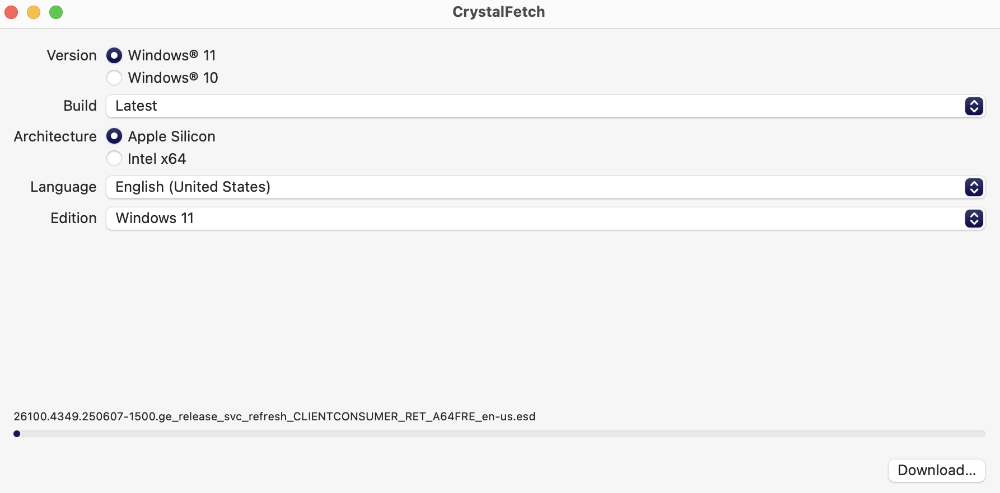
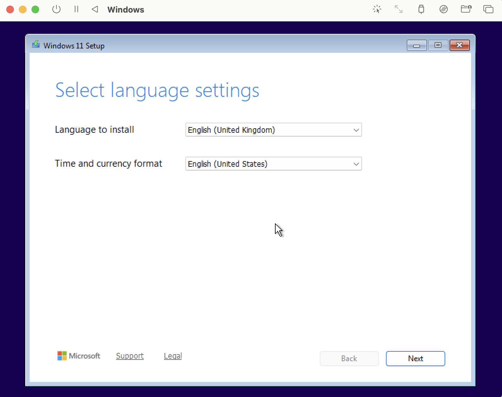
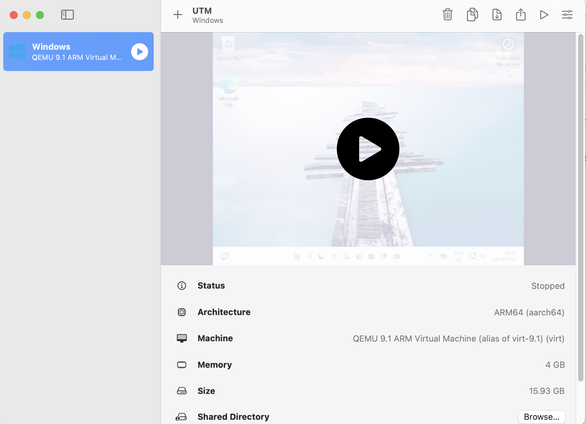
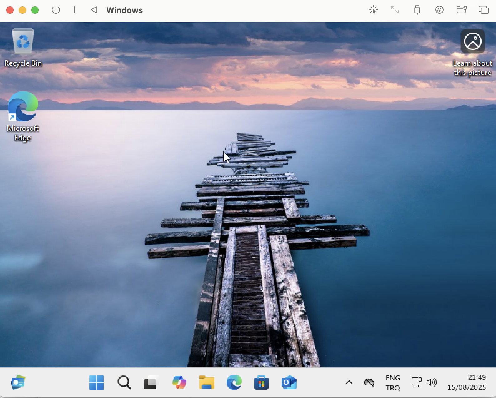

# Windows on Mac via UTM

This guide explains how to set up a Windows ARM virtual machine on macOS using **UTM** and **CrystalFetch ISO Downloader
**. It covers downloading the ISO, configuring the VM, and optimizing display settings.

---

## Prerequisites

- A Mac with Apple Silicon (M1, M2, etc.)
- [UTM](https://mac.getutm.app/) installed
- CrystalFetch ISO Downloader app

---

## Step 1: Download the Windows ARM ISO

1. Open **CrystalFetch ISO Downloader** on your Mac.
2. Select the **Windows 11 ARM Insider Preview** build you want to download.
3. Choose **Home + Pro edition** (default selection works for most users).
4. Wait until the download is complete. You will have an ISO file ready to use with UTM.

---

## Step 2: Create a New VM in UTM

1. Open **UTM**.
2. Click **+** to create a new virtual machine.
3. Select **Virtualize** → **Windows ARM**.
4. Configure the following settings:

    - **CPU:** 4 cores (recommended)
    - **Memory:** 4096 MB or more
    - **Storage:** 64 GB NVMe disk (sparse disk recommended)

5. Under **CD/DVD Drive**, select the ISO file you downloaded from CrystalFetch.

---

## Step 3: Configure VM Display and Input

- **Keyboard Layout:** Turkish Q (or US if you use an English keyboard)
- **Display Settings:**
    - Enable Retina / scaled display if available
    - Allocate more video memory if the screen appears blurry
- **UTM Guest Tools:** Install after Windows is running for better graphics and input integration

---

## Step 4: Install Windows ARM

1. Start the VM. It should boot from the ISO.
2. Follow the Windows installation steps:
    - Select language, keyboard layout, and time zone.
    - Choose the NVMe virtual disk as the installation target.
3. Complete the installation. Once finished, **remove the ISO from the CD/DVD drive** in UTM.
4. Restart the VM. It should boot directly into Windows ARM from the virtual disk.

---

## Step 5: Post-Installation Tips

- **Storage:** The VM disk will consume space based on what you allocated (e.g., 64 GB) and used by Windows + apps.
- **Display Optimization:** Adjust scaling in Windows settings and install UTM Guest Tools to reduce blurriness.
- **Shutting Down:** Use “Shut Down” instead of “Stop” to avoid booting from ISO again.
- **Deleting the VM:** Remove the VM in UTM and delete the associated `.utm` folder from
  `~/Library/Containers/com.utmapp.UTM/Data/Documents/<UTM_NAME>/` to free space.

---

## Notes

- You do **not need a license key** to run Windows ARM Insider Preview in a virtual machine, but a license is required
  for production use or activation.
- Performance will vary depending on your Mac model and allocated resources.

